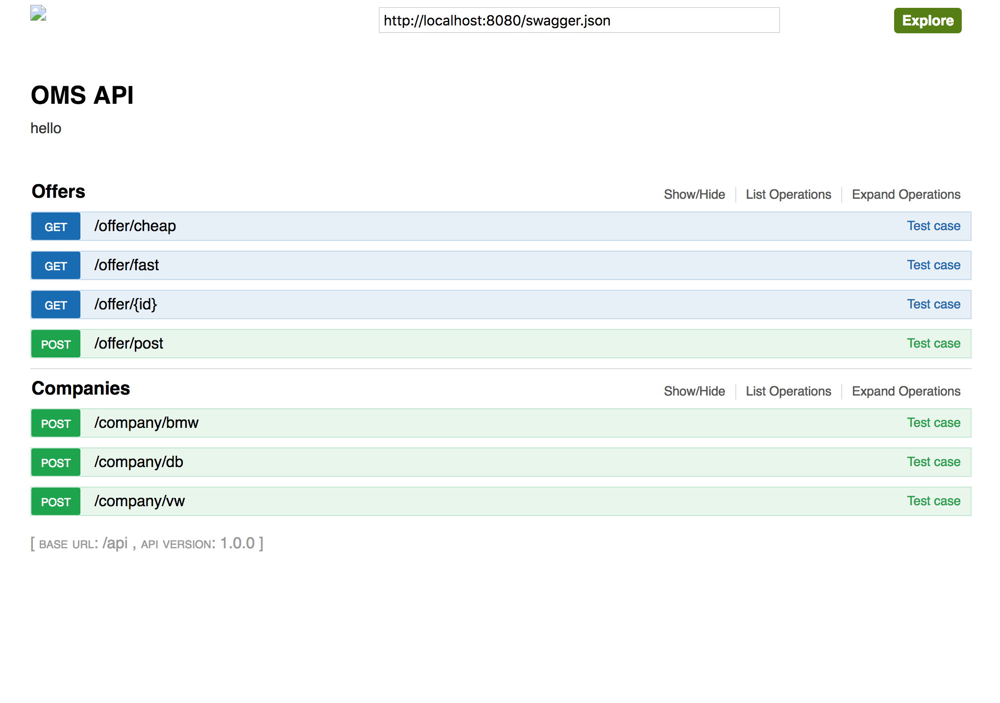

# WELCOME to the repo of OMS - Mobility as a Service (MaaS)!   

## THE TEAM

Our team consists of five passionated guys with different backgrounds.

**[Alexander Murgoci](https://github.com/fraggler)** - Business practioneer with a passion for innovative technologies and Python   
(www.linkedin.com/in/alexandermurgoci)    

**[Benedikt Jäger](https://github.com/)** - Stark-ish mechatronic-guy with a soft-spot for Java
(www.linkedin.com/in/benedikt-jaeger)   

**[Christian Meggle](https://github.com/prunkton)** - Originator and Backend/Middleware guru with Java   
(www.linkedin.com/in/christian-meggle)   

**[Fei Liu](https://github.com/geastwood)** - Multi-Ninja on the Frontend- and IOTA-side   
(https://www.linkedin.com/in/fei-liu-380aa7168/)

**[Stefan Kreißl](https://github.com/stefankreissl)** - Bridgebuilder between business & development, with mobility business and Frontend, Backend, IOTA & Ethereum development experience (https://de.linkedin.com/in/stefankreissl)

## IDEA
We want to enable companies to enter the mobility market. Our idea is to develop a clear & crisp REST API to ease implementation on company and customer UI. Such way we hope more customer and mobility provider hook up in a distributed mobility ledger.

## PRESENTATION

## PLATFORM
- IOTA

## ARCHITECTURE

The Java part of this project is heavily driven by maven. There is a lot of prepossessing going on. Just to point out some steps:
1. we define our API from a business point of view, so practically we write our business login into an yaml file (api.yaml) and
2. let swagger during the maven preprocessor (compile) transform the yaml into Java (by using jaxrs as a framework) code.
3. How these Java-files are actually created depends on swagger templates we overwrite in the generator -> resources/RestGenerator, api.mustache is the place where some magic happens.
4. to make it even more nasty, we generate by hand a json-file out of your self written api.yaml. We then saved it into the static folder and make it available for our frontend documentation.
5. After all, our server get started in its specific sub-project, there you can also find some more REST* implementations

## TECHNOLOGY
We use the following technologies in pursuit of mobility happines:

 - Apache
 - Java
 - Node JS
 - React
 - IOTA JS SDK

## LIBRARY

 - SWAGGER (aka OpenAPI)
 - Spring Boot
 
## TOOLS

 - IntelliJ
 - NEOVIM
 
 ## IOTA

IOTA part provides 3 APIs

1. publishing provider mobility offer to IOTA tangle net   
"node iota/apiPublish.js --payload='{"name": "fei", "test":"again1", "provider": "bmw"}'"   

2. get payable provider address for end user to conduct transaction    
node iota/apiGetAccount.js --provider=bmw // possible providers are bmw, vw and db 

3. authorize and confirm payment

## DEMOS

1. App demo -> how a user can interact with our service, e.g. finding a offer
   on IOTA from different mobile providers and conclude a contract via IOTA.

2. Get payable address of mobile provider

3. Publish mobility offer on IOTA

4. Backend Java API for mobile provider to publish offers

## FRONTEND

